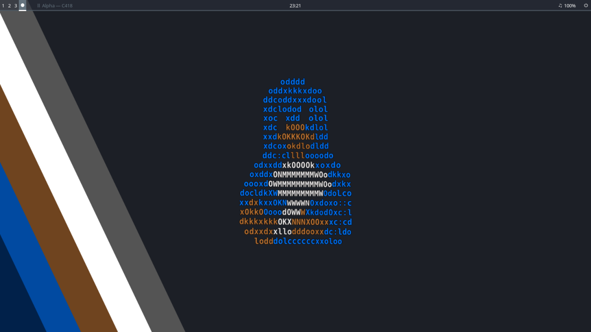
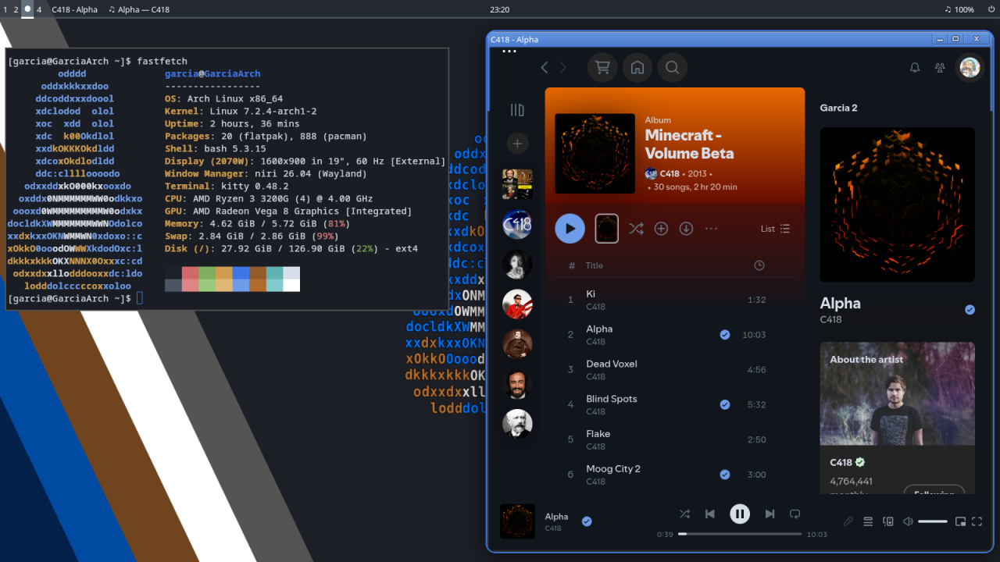
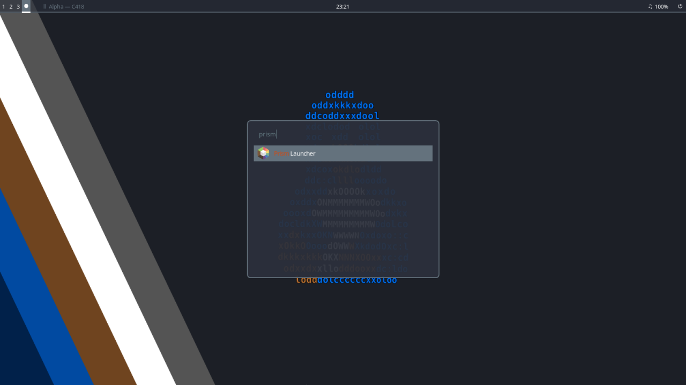

# My Niri Dotfiles

A minimal and fast Linux desktop environment built around
[Niri](https://github.com/YaLTeR/niri) and Arch Linux.

> Inspired by my favorite distribution, CRUX.

  

## ✦ Overview

This repository contains my personal Linux desktop
configuration, focused on simplicity, performance and
a consistent visual style.

The setup is built around Niri, Waybar and a collection
of lightweight applications, with a dark interface and
blue accents inspired by CRUX.

## ✦ Components

| Component | Software |
|-----------|----------|
| WM | Niri |
| Bar | Waybar |
| Launcher | Fuzzel |
| Terminal | Kitty |
| File Manager | Dolphin |
| Music | Spotify / Spicetify |
| Media Control | Playerctl / MPRIS |
| Wallpaper | Swaybg |
| System Info | Fastfetch |

## ✦ Features

- Minimal Niri configuration
- Custom Waybar
- Fuzzel application launcher
- Custom Kitty theme
- CRUX-inspired aesthetic

## ✦ Screenshots

### Desktop

  

### Spotify

  

### Fuzzel

  

## ✦ Color Palette

| Color | Hex |
|-------|-----|
| Background | `#11151c` |
| Surface | `#1c2129` |
| Foreground | `#d8dee9` |
| Accent | `#3f76e6` |
| Light Accent | `#6f9ce8` |
| Gray | `#64727d` |

## ✦ Keybinds

| Key | Action |
|-----|--------|
| `Super + F` | Firefox |
| `Super + E` | Kitty |
| `Super + R` | Dolphin |
| `Super + D` | Fuzzel |
| `Super + Space` | Fuzzel |
| `Super + Shift + F` | Fullscreen |
| `Super + M` | Maximize |
| `Super + V` | Toggle floating |
| `Super + W` | Tabbed layout |
| `Super + Alt + L` | Lock screen |
| `Print` | Screenshot |

