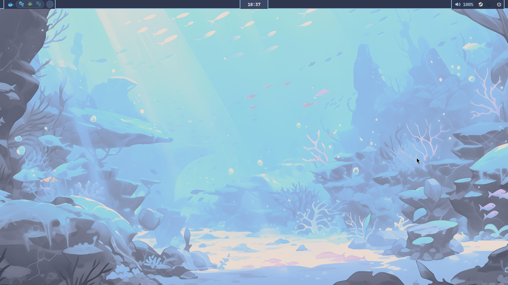
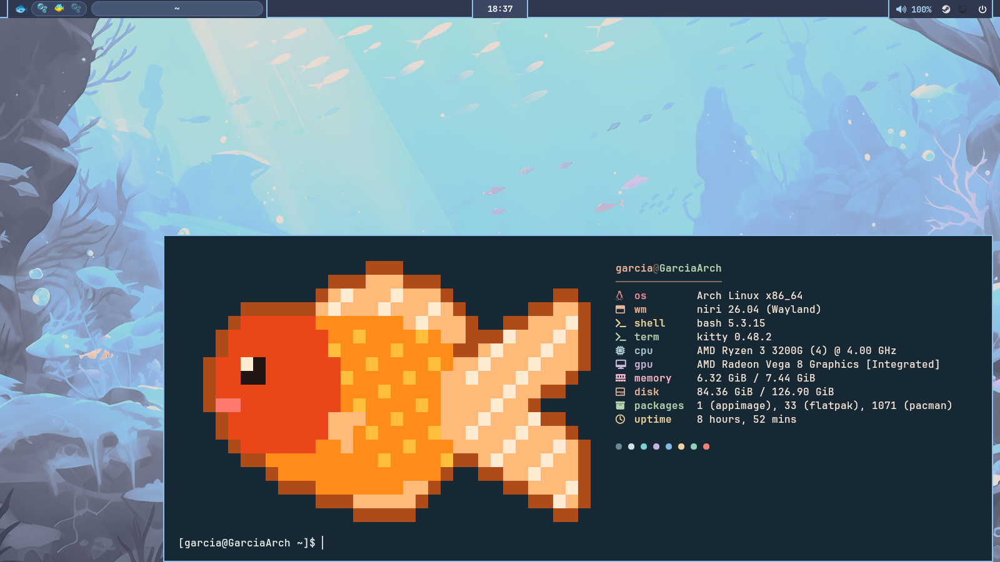
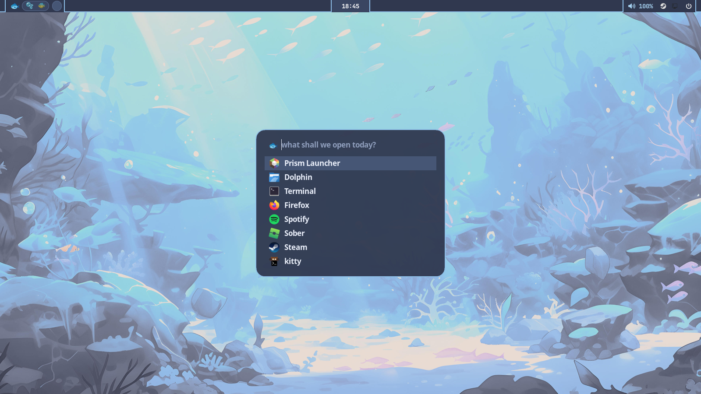

# My Niri Dotfiles 🐟

A aquatic-themed Linux dotfiles for
[Niri](https://github.com/YaLTeR/niri) and Arch Linux

  

## ✦ Overview

This repository contains my personal Linux desktop
configuration, featuring a soothing oceanic visual style.

The setup is built around Niri, Waybar, and a some customized applications with soft cyan and oceanic blue tones.
It also includes 10 different fish images to cycle through in the terminal/Fastfetch!

Wallpaper by [orangci/walls-catppuccin-mocha](https://github.com/orangci/walls-catppuccin-mocha).

## ✦ Components

| Component | Software |
|-----------|----------|
| WM | Niri |
| Bar | Waybar |
| Browser | Firefox |
| Launcher | Fuzzel |
| Terminal | Kitty |
| File Manager | Dolphin |
| Wallpaper | Swaybg |
| System Info | Fastfetch |

## ✦ Features

- Custom Waybar with fish-themed workspace icons 🐟
- Fuzzel application launcher
- Custom Kitty theme

## ✦ Screenshots

### Kitty

  

### Fuzzel

  

## ✦ Keybinds

| Key | Action |
|-----|--------|
| `Super + F` | Firefox |
| `Super + E` | Kitty |
| `Super + R` | Dolphin |
| `Super + Space` | Fuzzel |
| `Super + Shift + F` | Fullscreen |
| `Super + M` | Maximize |
| `Super + V` | Toggle floating |
| `Super + W` | Tabbed layout |
| `Super + Alt + L` | Lock screen |
| `Print` | Screenshot |
| `MOD+Shift+E` | Quit |
